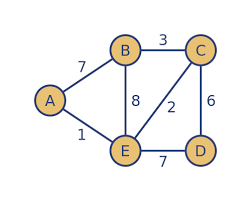
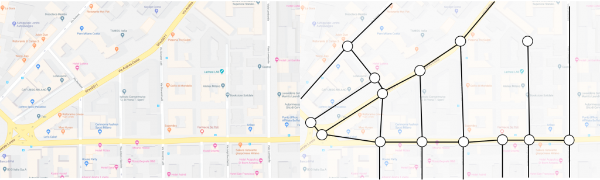
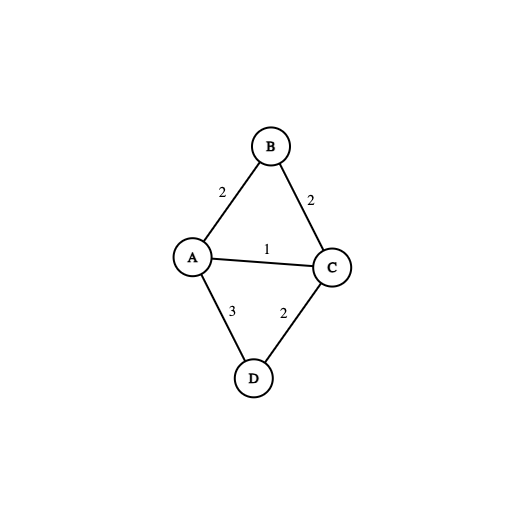
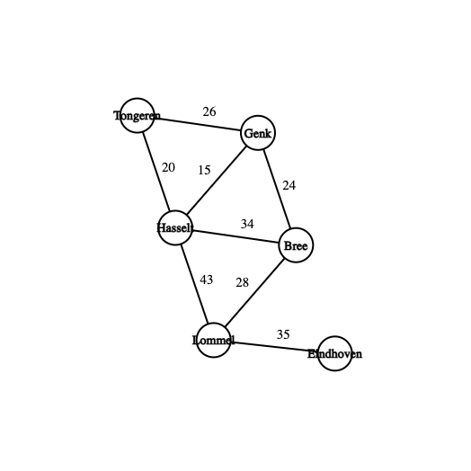

## Generieke klassen en methoden

De student kan:
- een generieke klasse, methode, interface implementeren en gebruiken
- kent de definitie van een graaf en kan voorbeelden geven
- kent de belangrijkste concepten van grafen
- kan het algoritme van Dijkstra bescrhijven 
- kan het algoritme van Dijkstra toepassen om het kortste pad te berekenen
- kan Dijkstra's algoritme implementeren in Java

We bouwen een graaf en passen Dijkstra toe om het kortste pad te berekenen. 
We beginnen met basisconcepten, implementeren een graaf, en eindigen 
met realistische toepassingen zoals het berekenen van routes tussen steden of een doolhof oplossen.

## 1. Grafentheorie: basis

### 1.1 Definitie van een graaf

Een graaf G wordt gedefinieerd als een geordend paar G = (V, E), waarbij:

- V is een eindige verzameling van knopen (vertices)
- E is een eindige verzameling van bogen (edges)
- Elke boog e ∈ E verbindt twee knopen u, v ∈ V. We noteren een boog als uv of vu




### 1.2 Belangrijke Concepten

#### Pad:

- Een pad is een rij knopen (v₁, v₂, ..., vₙ)
- Tussen elke opeenvolgende knopen bestaat een boog
- Elke knoop mag hoogstens één keer voorkomen

#### Gewogen Graaf:

- Ook wel een netwerk genoemd
- Aan elke boog is een waarde (gewicht) toegekend
- Gewichten kunnen afstanden, tijden, kosten, etc. voorstellen

#### Samenhangende Graaf:

- Tussen elk tweetal knopen bestaat een pad
- Essentieel voor het vinden van kortste paden

## 2. Het Algoritme van Dijkstra

### 2.1 Inleiding

Edsger W. Dijkstra (1930–2002) was een Nederlandse informaticus en een van de grondleggers van de
theoretische informatica. Hij is vooral bekend om zijn Dijkstra's algoritme, een efficiënt 
algoritme voor het vinden van de kortste paden in een graaf, wat veel wordt gebruikt in 
navigatiesystemen en netwerkrouting. 
Daarnaast heeft hij grote bijdragen geleverd aan softwareontwikkeling, bijv. programmeren zonder 
gebruik van de goto-statement. Zijn invloed op de informatica is enorm, en veel van zijn 
ideeën worden nog steeds gebruikt in moderne softwareontwikkeling.
   

### 2.2 Werking van het Algoritme

Het algoritme werkt in vier hoofdstappen:
- **Stap 1: Initialisatie**

    Kies de beginknoop als huidige knoop

    Ken waarde 0 toe aan beginknoop

    Ken waarde ∞ toe aan alle andere knopen

    Markeer alle knopen als niet-bezocht

- **Stap 2: Update buren**

    Voor elke niet-bezochte buur van de huidige knoop:

    - Bereken kandidaat-afstand = afstand_tot_huidige + boog_gewicht
    - Als kandidaat-afstand < huidige_afstand: Update afstand en onthoud voorganger

- **Stap 3: Selectie**

  Markeer huidige knoop als bezocht

  Kies niet-bezochte knoop met laagste kandidaat-afstand als nieuwe huidige knoop

  Ga terug naar Stap 2 indien er nog niet-bezochte buren zijn

- **Stap 4: Resultaat**

    Reconstrueer kortste pad via voorgangers

    Geef kortste pad en totale afstand terug


https://www.youtube.com/watch?v=UG7VmPWkJmA&t=33s

## 3. Implementatie 

### 3.1 De klasse Graph

We maken een klasse Graph om de volgende graaf voor te stellen. 



Er zijn verschillende manieren om grafen voor te stellen in Java:

- Adjacency map 
    ```
    public class Graph {
      private Map<Charater, Map<Charater, Integer>> adjacencyMap;
    }
    ```
    Waarbij we alle knopen als key bijhouden en de aangrenzende knopen met hun gewicht als value. 
    Dit is een eenvoudige implementatie waarbij we de bogen (of buren) snel kunnen opzoeken.

- Adjacent matrix
    ```
    public class Graph {
      private int[][] matrix;
      private List<Character> vertices;
    }
    ```
    De index in de lijst geeft de plaats van de knoop in de matrix weer. Aan de hand van de indices van
    2 knopen kan de afstand tussen de knopen dan opgezocht worden in de matrix.

- Zijdenlijst (Edge List)
  Dit is een meer object-georierenteerde implementatie 
  ```
   public class Edge {
        private Character source;
        private Character destination;
        private int weight;
        // Additional edge properties can go here
    }
    
    public class Graph {
        private Set<Character> vertices;
        private List<Edge> edges;
    }
    ```

Iedere implementatie komt met voor- en nadelen. Wij kiezen voor de adjacency map.

Implementeer de volgende methoden: 

- [ ] void addVertex(Character vertex)
- [ ] void addEdge(Character v1, Character v2, int distance)
- [ ] Map<Character, Integer> getNeighbours(Character vertex)
- [ ] Set<Character> getVertices()


Maak nu een nieuwe klasse met een main-methode waar je de graaf bouwt en de buren van knoop 'A' afdrukt met hun gewicht.

```
Verwachtte output:
B 2
C 1
D 3
```

### 3.2 De generieke klasse Graph

We willen onze graaf flexibel maken, zodat deze niet alleen met karakters ('A', 'B', etc.) werkt, 
maar ook met andere typen zoals steden (String).
Maak de klasse Graph nu generiek zodat je ook de volgende graaf kan implementeren.




### 3.3 Hulpklasse Node

We maken de klasse Node met de eigenschappen:
- vertex (T)
- distance (int)

De klasse houdt de afstand van de  beginvertex tot de vertex zelf bij tijdens het uitvoeren van 
Dijkstra's algoritme.
We moeten nodes kunnen sorteren op basis van hun afstand: kleinste afstand eerst.
Schrijf unit testen om te controleren dat de nodes correct gesorteerd worden.

### 3.4 De klasse PathResult

De klasse PathResult bewaart een opeenvolging van knopen die een pad vormen en 
het totale gewicht (afstand) van de het pad.

De methode toString() geeft de opeenvolgende knopen in het pad en het totale gewicht.


### 3.5 Implementatie van Dijkstra's algoritme

In de klasse Graph implementeer je nu de methode:
- [] PathResult<T> dijkstra(T fromVertex, T toVertex)

Implementatie-details:
- Gebruik een PriorityQueue: De PriorityQueue wordt gebruikt om altijd de knoop met de kortste bekende afstand als eerste te verwerken.
- Gebruik een Set voor bezochte knopen
- Houd de kortste paden en hun afstanden bij.

```
Function dijkstra(start, end):
    Maak een PriorityQueue pq (min-heap) voor knopen (vertex, distance)
    Maak een Set visited voor bezochte knopen
    Maak een Map paths om de kortste afstanden en paden bij te houden

    // Initialisatie van afstanden en paden
    Voor elke knoop in de graaf:
        paths[knoop] = (∞, lege lijst)
    paths[start] = (0, [start])

    Voeg (start, 0) toe aan pq

    Terwijl pq niet leeg is:
        Huidige knoop = verwijder knoop met kleinste afstand uit pq

        Als huidige knoop == end:
            Return paths[end]

        Als huidige knoop al bezocht is:
            Ga verder met volgende iteratie

        Voeg huidige knoop toe aan visited

        Voor elke buur van huidige knoop:
            Bereken nieuwe afstand = huidige afstand + afstand naar buur

            Als nieuwe afstand korter is dan de huidige opgeslagen afstand:
                Werk paths[buur] bij met het nieuwe pad en afstand
                Voeg buur toe aan pq met nieuwe afstand

    Return null  // Geen pad gevonden
```
Test je implementatie van Dijkstra's algoritme.
Voer de methode dijkstra() uit op de eerder gemaakte grafen en 
controleer of de kortste routes correct zijn.

Gebruik je implementatie van dijkstra() om het kortste pad tussen B en D te berekenen. 
Print het pad en de totale afstand.

Wat is het kortste pad van Genk naar Eindhoven?

## 4. Use case 1: cities

Lees het bestand cities.txt in en maak de graaf. 
Wat is het kortste pad van Madrid naar Paris? Geef het pad en de totale afstand.

## 5. Use case 2: doolhof

Gegeven een doolhof in bestand maze.txt. Lees het bestand in en genereer een graaf. 
Alle buren van een cel die geen muren zijn, worden bijgehouden in de graaf met een gewicht 1.
We zoeken vervolgens het kortste pad van S naar E.

Pas de methode drawMaze aan zodat het kortste pad wordt getoond.
Oplossing:
```
###########
#********##
# ######*##
#      #*##
# #### #*##
# #    #*##
# # ####*##
#      #*##
# ####   ##
###########
###########
```
